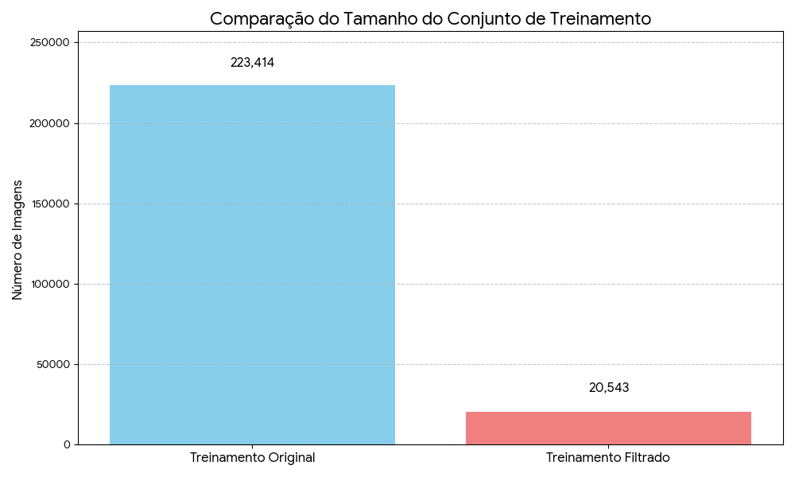
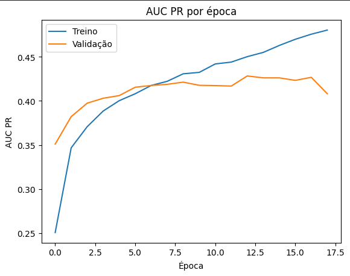
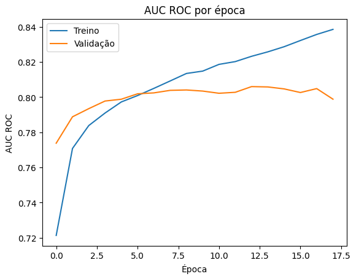

# Computer_Vision_Medicine

## FIAP - Faculdade de Informática e Administração Paulista

<p align="center">
<a href= "https://www.fiap.com.br/"></a>
</p>
<br>

# Classificação de Anomalias em Radiografias de Tórax com CNN

Classificação Multi-Rótulo de 14 Anomalias em Radiografias de Tórax Utilizando Deep Learning com Transfer Learning (InceptionV3) e Módulo de Atenção CBAM Treinado no Dataset CheXpert.

## 👨‍🎓 Integrantes:

- <a href="https://www.linkedin.com/in/bryanjfagundes/">Bryan Fagundes</a>
- <a href="https://br.linkedin.com/in/brenner-fagundes">Brenner Fagundes</a>
- <a href="https://www.linkedin.com/in/diogo-botton-46ba49197/">Diogo Botton</a>
- <a href="https://www.linkedin.com/in/hyankacoelho/">Hyanka Coelho</a>
- <a href="https://www.linkedin.com/in/julianahungaro/">Juliana Hungaro Fidelis</a>

## 👩‍🏫 Professores:

### Tutor(a)

- <a href="https://www.linkedin.com/in/leonardoorabona?utm_source=share&utm_campaign=share_via&utm_content=profile&utm_medium=android_app">Leonardo Ruiz Orabona</a>

### Coordenador(a)

- <a href="https://www.linkedin.com/in/andregodoichiovato/">André Godoi</a>

## 📜 Descrição

Este projeto desenvolve um modelo baseado em Redes Neurais Convolucionais (CNNs) para identificar **14 anomalias** em radiografias de tórax utilizando o dataset **CheXpert-v1.0-small**.

A tarefa é uma **classificação multi-rótulo**, onde uma mesma imagem pode conter várias patologias simultaneamente. O pipeline inclui:

- Pré-processamento e padronização das imagens
- Filtragem por projeção (Frontal/PA)
- Deduplicação por paciente para evitar viés
- Tratamento de incertezas com a estratégia **U-Zero** - Criação do modelo com **InceptionV3 + módulo de atenção CBAM** - Avaliação com métricas adequadas a dados desbalanceados (PR AUC, ROC AUC, F1)
- Deploy via Docker + FastAPI
- Protótipo de interface para inferência

### Link do vídeo de demonstração do projeto

[Classificação de Anomalias em Radiografias de Tórax com CNN](https://youtu.be/haEzVRNT40o)

---

## 1. ⚙️ Pré-processamento de Dados e Organização

Este trabalho focou na preparação do _dataset_ **CheXpert-v1.0-small** para a classificação multi-rótulo, aplicando etapas de pré-processamento para garantir um subconjunto de dados limpo e coerente.

### 1.1. Estratégias de Pré-processamento

As escolhas foram guiadas pela necessidade de padronizar a qualidade da imagem e mitigar o viés de paciente.

| Etapa de Pré-processamento  | Escolha Implementada                     | Justificativa Principal                                                                                                                          |
| :-------------------------- | :--------------------------------------- | :----------------------------------------------------------------------------------------------------------------------------------------------- |
| **Filtragem de Imagens**    | Apenas imagens Frontal/PA                | Padronização da qualidade da imagem e redução da variabilidade, pois a projeção PA é geralmente preferida.                                       |
| **Deduplicação**            | Uma imagem aleatória por PatientID       | Mitigação do viés de correlação de paciente, garantindo que o modelo seja treinado em uma amostra mais independente.                             |
| **Tratamento de Incerteza** | U-Zero (-1.0 e NaN substituídos por 0.0) | Simplificação do problema para classificação binária (presença/ausência) para as 14 classes, assumindo que a incerteza é equivalente à ausência. |

### 1.2. Impacto no Volume de Dados

A etapa de **deduplicação** foi a que gerou o maior impacto na redução do volume de dados, garantindo a independência das amostras de treinamento.

- O conjunto de treinamento foi reduzido de $223.414$ para **$20.543$ imagens**.
- O conjunto de teste (validação) foi filtrado para manter apenas imagens Frontal/PA, resultando em **$33$ imagens**.

#### Comparação do Tamanho do Conjunto de Treinamento



---

## 2. 📈 Métricas e Avaliação do Modelo

O modelo de classificação multi-rótulo foi avaliado utilizando métricas adequadas para problemas com classes desbalanceadas, como a **Área Sob a Curva Precision-Recall (PR AUC)** e a **Área Sob a Curva Receiver Operating Characteristic (ROC AUC)**.

### 2.1. Métricas Finais no Conjunto de Teste

As métricas finais foram calculadas após o treinamento no conjunto de teste, utilizando o modelo que obteve o melhor `val_auc_pr`.

| Métrica          | Valor        |
| :--------------- | :----------- |
| ROC AUC Micro    | $0.8069$     |
| ROC AUC Macro    | $0.6774$     |
| **PR AUC Micro** | $0.4488$     |
| **PR AUC Macro** | **$0.2554$** |
| F1 Score Macro   | $0.1164$     |
| F1 Score Micro   | $0.2985$     |

**Observações:** A métrica **PR AUC Macro** ($0.2554$) é a mais relevante, pois é menos sensível ao desbalanceamento de classes, refletindo a dificuldade do modelo em classificar as patologias mais raras. O **F1 Score Macro** ($0.1164$) também é baixo, confirmando o desafio em um cenário médico com alta disparidade de ocorrência das doenças.

### 2.2. Histórico de AUC PR (Área Sob a Curva Precision-Recall)

O gráfico de AUC PR é a métrica principal de monitoramento durante o treinamento. Ele demonstra o ponto onde o **Early Stopping** foi acionado (pico de validação de $\approx 0.4283$).



### 2.3. Histórico de AUC ROC (Área Sob a Curva Receiver Operating Characteristic)

O gráfico de AUC ROC mostra a capacidade geral do modelo de distinguir entre classes positivas e negativas, atingindo um pico de validação de $\approx 0.8059$.



---

# 🧠 Resumo Técnico

- **Tipo:** Classificação multi-rótulo (14 classes)
- **Dataset:** CheXpert-v1.0-small
- **Modelo:** InceptionV3 + CBAM
- **Técnicas:** Transfer Learning, Attention Module, Early Stopping
- **Métricas:** PR AUC, ROC AUC, F1 Score
- **Deploy:** Docker + FastAPI
- **Notebook principal:** `chexpert_cnn.ipynb`

## 📁 Estrutura de pastas

Dentre os arquivos e pastas presentes na raiz do projeto, definem-se:

- <b>assets</b>: Aqui estão os arquivos relacionados a elementos não-estruturados deste repositório, como imagens.

- <b>scripts</b>: Aqui está um arquivo de implementação (deploy), no caso, o docker-compose.yml que realiza o deploy da API juntamente com o modelo.

- <b>src</b>: Todo o código fonte criado.

## 🔧 Como executar o código

Para executar a API com o modelo gerado atráves do notebook `chexpert_cnn.ipynb` e o frontend para integração com a API e visualização dos resultados, é necessário ter o Docker instalado em sua máquina. Com ele instalado, basta com alguma CLI (por exemplo, o prompt do windows) navegar até a pasta `scripts` e digitar:

```bash
    docker-compose up -d --build
```

Ao rodar o comando, a API estará disponível com a documentação do Swagger e pronta para ser acessada através da url: `http://localhost/docs`. O frontend estará disponível através da url: `http://localhost:8080`.

## 📋 Licença

<p xmlns:cc="http://creativecommons.org/ns#" xmlns:dct="http://purl.org/dc/terms/"><a property="dct:title" rel="cc:attributionURL" href="https://github.com/agodoi/template">MODELO GIT FIAP</a> por <a rel="cc:attributionURL dct:creator" property="cc:attributionName" href="https://fiap.com.br">Fiap</a> está licenciado sobre <a href="http://creativecommons.org/licenses/by/4.0/?ref=chooser-v1" target="_blank" rel="license noopener noreferrer" style="display:inline-block;">Attribution 4.0 International</a>.</p>
